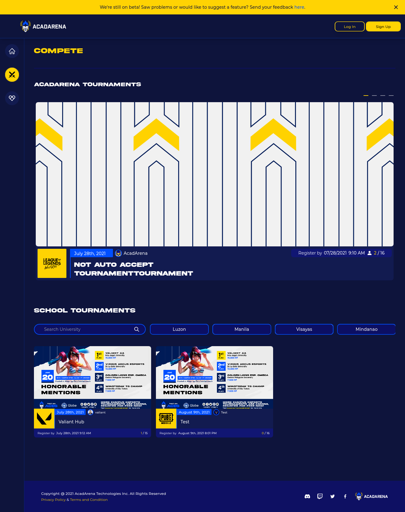
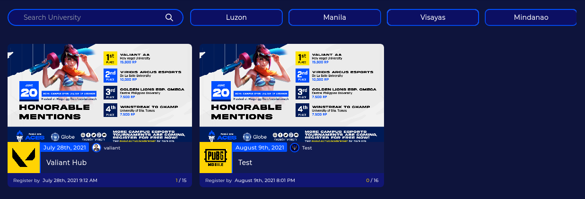
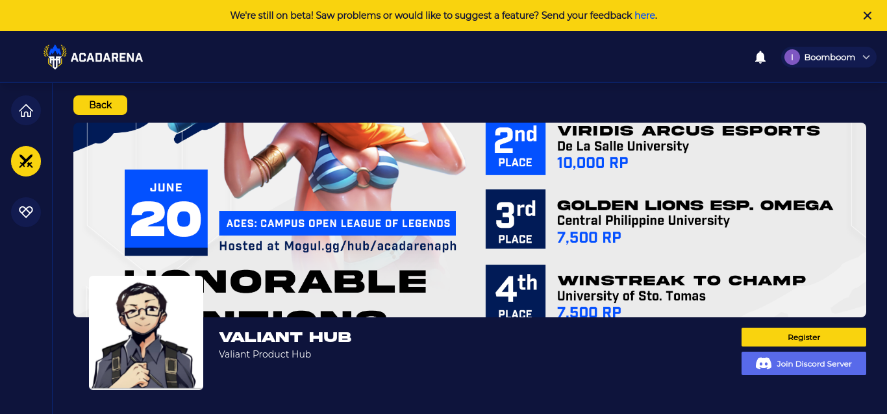
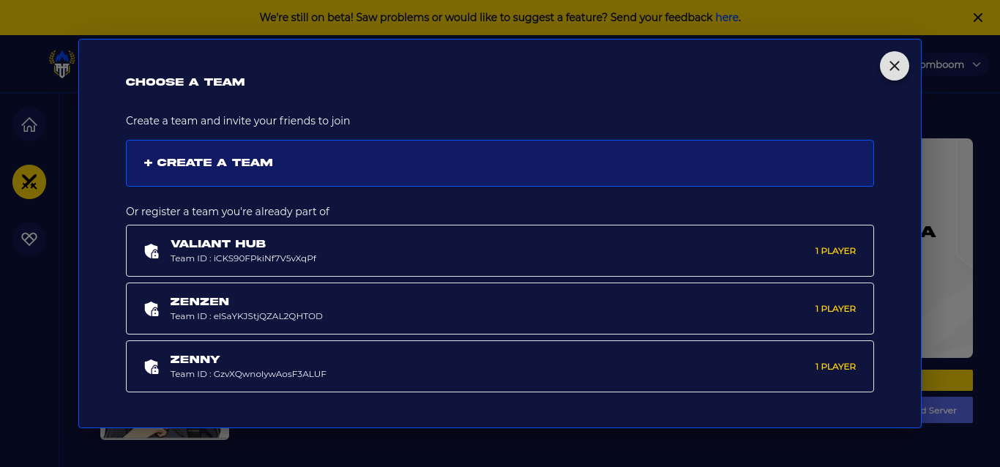
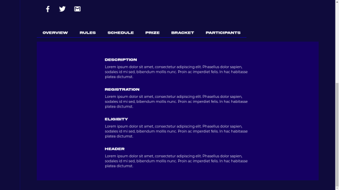
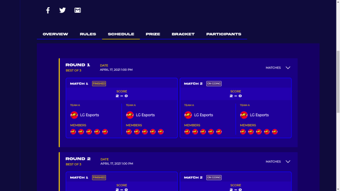

# Compete Page

Players/Team Leader can view acad arena tournaments and school tournaments in this section, users can browse through this area and see what is the different tournaments are already posted with Registered date, time and number of players participated

The Compete in link for the Project Waypoint is available at `SideBar > Compete`

## School Tournament

Player/Team Captain and user can browse this area to see what is the latest school tournaments are already published, users can also perfom specific actions such as `Search and filter region`

## Compete Profile

Upon clicking the school tournaments that is posted in the scool tournament section `Sidebar > Compete` or in the Front page `Sidebar > Frontpage` they will be redirecting in this compete profile where they can browse the rules, prizes, participants and brackets of the specific tournament

## Join Tournament

Players can also join tournaments by creating a new team, or register the team they are already part of, only team captain can access this section

The Register Link for the Project Waypoint Compete is available at `Sidebar > Compete` then Select Tournaments you want to part of, then click `Register` Button

## Compete Rules

Each tournaments have the rules/description of their own, user can navigate and see what kind of rules/description that specific tournament has

## Compete Schedule

Players/Team captains also can see a different kind of schedule each tournament, with the score indicated each round, it has also a players and captais profile as well as the logo of the respective teams, also each round has a banner if the tournament is still on going or it is already finished

