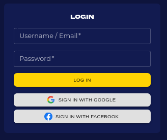
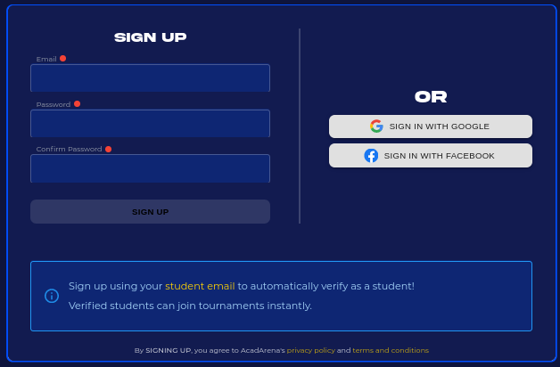
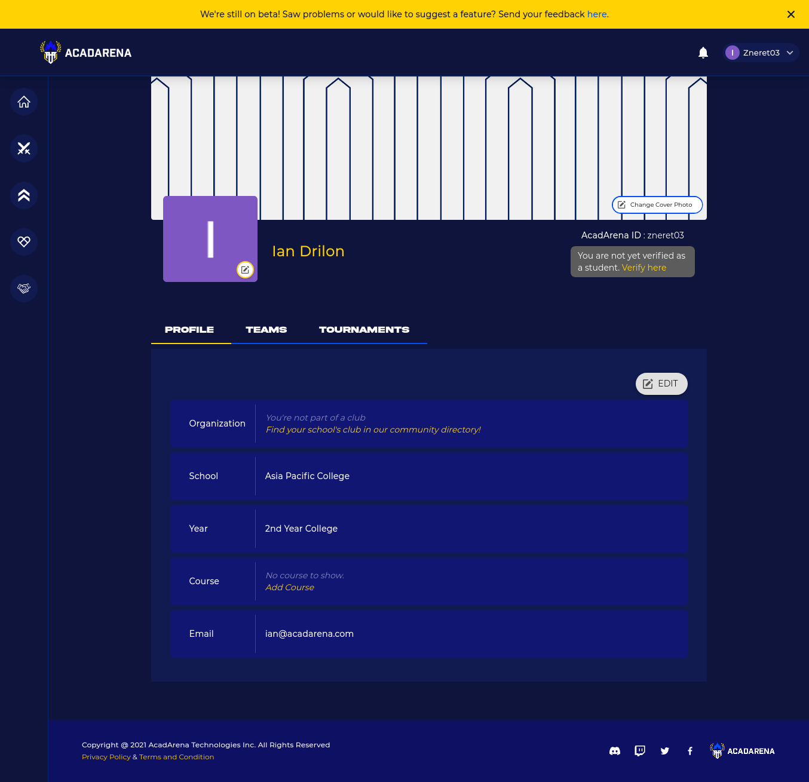
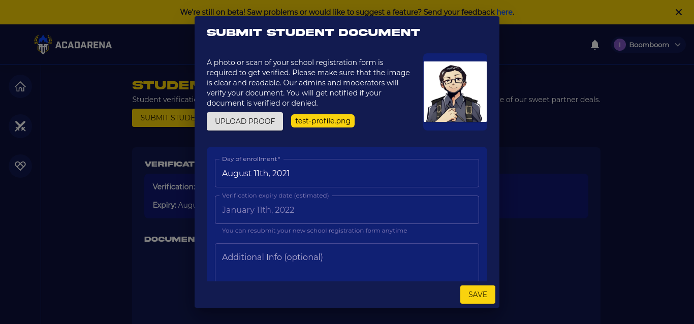

# Login

Players/Team Leader are given special accounts where they can setup their own team account, add players, edit and update basic informations and navigate through different torunaments they already joined

<!-- Players are given special accounts by the admin in order to use the system. An encoder can perform basic data operations and modify their personal settings like profile name or password. It is recommended that all region encoders should use their true email for password recovery purposes. -->

The Login in link for the Project Waypoint is available at `Navigation Bar > Login`

### Sign up

Player/Team Captain that is not yet registered, they can sign up a new account in sign up tab in navigation bar
The Sign up in link for the Project Waypoint is available at `Navigation Bar > Sign up`

### User Profile

Players/Team Captain can add their school club if they dont have one they can also modify their school, year level, course and email

### Student Verification

Upon signing, users who are not verified needs to verify their account, so they can fully use the Project Waypoint Functionality

